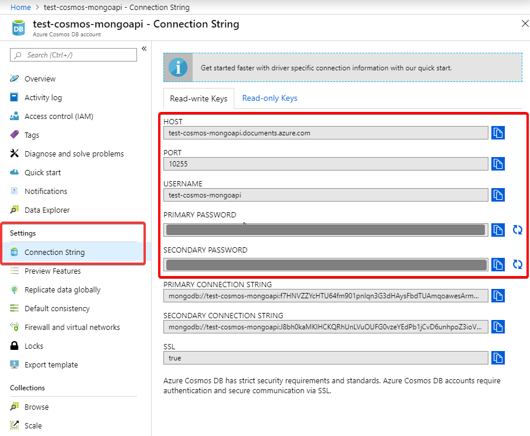

# Azure Examples: Cosmos DB and Mongoose

[](https://dev.azure.com/julie-msft/cosmosdb-mongoose-example/_build/latest?definitionId=1&branchName=master)

This repository shows how to use [Cosmos DB](https://docs.microsoft.com/en-us/azure/cosmos-db/) with Node.js and the [MongoDB protocol](https://docs.microsoft.com/en-us/azure/cosmos-db/mongodb-introduction) with the popular [mongoose](https://www.npmjs.com/package/mongoose) npm package.

- create and setup database in Azure Portal
- code examples with [mongoose](https://www.npmjs.com/package/mongoose) library
- [cost-optimized examples with mongoose discriminators](#azure-cost-optimization)

This is the goal result:

```
$ npm run simple-examples

> node examples/simple/run.js

[INFO] Connected (…)
[INFO] Number of Families: 4
[INFO] New Family saved (…)
[INFO] Number of Families: 5
[INFO] Disconnected, bye bye
```

This repository guides you through the examples. It is recommended to [browse through on GitHub.com](https://github.com/julie-ng/cosmosdb-mongoose-example/) before trying out the code.

Note: some code is from [the official azure docs](https://docs.microsoft.com/en-us/azure/cosmos-db/mongodb-mongoose). It was fixed, updated for 2019 and adds CI to ensure the example remains working.

## Step 1 - Create a Cosmos DB in Azure Portal

1. Login to [https://portal.azure.com &rarr;](https://portal.azure.com)

2. Follow the the official [Azure Docs: Connect a Node.js Mongoose application to Azure Cosmos DB](https://docs.microsoft.com/en-us/azure/cosmos-db/mongodb-mongoose) to create a cosmos account. Then come back here. *Do not follow the Node.js code, which is outdated.*

3. Enable **Aggregation Pipeline** in your CosmosDB per [aka.ms/mongodb-aggregation](https://aka.ms/mongodb-aggregation) to use mongoose's rich API.
	Otherwise some operations like mongoose's `db.collection.countDocuments()` will not work.


4. Take note of your credentials in the **Connect String** plane. You will need these later.

	

## Step 2 - Get Code 

First you need the code in this repository

```
git clone https://github.com/julie-ng/cosmosdb-mongoose-example
```

## Step 3 - Configure Credentials

To test your connection locally, copy `.env.example` and rename it to `.env` filling in your credentials:

| Variable | Example | Reference in Azure Portal
|:--|:--|:--|
| `DB_HOST` | `exampledb.documents.azure.com` | "Host" |
| `DB_USER` | exampledb | "Username" |
| `DB_PASSWORD` |  | "Primary Password" |
| `DB_PORT` | 10255 | "Port". Default is 10255 |
| `DB_NAME` | testdb | You must first create this in the "Data Explorer" plane of your Cosmos DB.|

## Last Step - run the examples

Finally, install the dependencies and run all examples:

```bash
npm install
npm run simple-examples
npm run optimized-examples
```

## Azure Cost Optimization

By default Mongoose creates a new colleciton per model. Because Azure charges you per collection, it makes sense to use [mongoose discriminators](https://mongoosejs.com/docs/discriminators.html) to leverage **schema inheritance** to optimize costs:


Then you only **pay once for the `Base` model collection** instaead of doubling costs for `Family` and `Vacation` models.

For more details [see the cost optimized examples &rarr;](./examples/cost-optimized/)

# Misc.

## New to JavaScript?

Don't worry. These examples are easy to follow. But just in case, you need some guidance:

- **Promises and Async/Await**  
	To run multiple examples with a single connection, we have to add some extra Promises. See details at [`./examples/README.md` &rarr;](./examples/README.md)

- **ES6 Modules**  
	Compared to the official Microsoft documentation, each operation is split into its own file, e.g. `family.add.js`. 
	
	[Learn about ES6 modules here on MSN &rarr;](https://developer.mozilla.org/en-US/docs/Web/JavaScript/Guide/Modules)

Have fun exploring the examples. If you have any questions, [open an issue &rarr;](./issues)